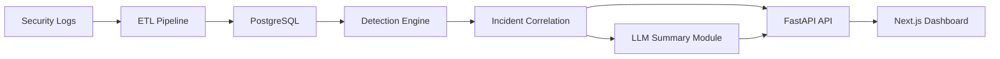

# Breach Analytics GenAI Platform

A full-stack AI-assisted breach analytics platform that ingests security telemetry, normalizes events through ETL, detects suspicious activity, correlates alerts into incidents, and generates auditable LLM-powered investigation summaries.

This project is designed as a portfolio-ready demonstration for breach analytics, AI/GenAI, ETL automation, database modeling, API development, and full-stack software engineering work.

## Why This Project Matters

Breach analytics teams often need to review logs from many systems, identify suspicious behavior across time, and turn technical evidence into clear investigation narratives. This project models that workflow end to end.

It supports investigation teams by:

- Reducing manual log review through repeatable ETL and detection workflows
- Normalizing multi-source telemetry into a consistent event schema
- Detecting suspicious behavior such as brute force login patterns, unusual access, privilege escalation, suspicious downloads, and endpoint alerts
- Correlating related alerts into incidents with timelines and supporting evidence
- Generating auditable AI-assisted summaries based only on stored incident, alert, and event data
- Supporting faster investigation, reporting, and handoff between technical and non-technical stakeholders

## Tech Stack

- Python
- FastAPI
- PostgreSQL
- SQLAlchemy
- Alembic
- pandas
- pytest
- Docker Compose
- Next.js
- React
- TypeScript
- LLM-ready summarization workflow with deterministic mock mode

## Architecture



Plain-English flow:

1. Fake security logs are loaded from `data/`.
2. The ETL pipeline stores original records and normalized events in PostgreSQL.
3. Detection rules analyze normalized events and create alerts.
4. Incident correlation groups related alerts into investigation-ready incidents.
5. FastAPI exposes events, alerts, incidents, workflow actions, and summaries.
6. The Next.js dashboard gives analysts a simple interface for reviewing the workflow.
7. The summary module generates auditable executive and technical summaries, using mock mode when no API key is configured.

More detail: [docs/architecture.md](docs/architecture.md)

## Features

- Realistic fake breach data across authentication, VPN, cloud audit, API access, and endpoint alert sources
- ETL normalization from mixed JSON and CSV logs into a common security event schema
- Raw event preservation for auditability
- Rule-based detection engine for suspicious breach activity
- Incident correlation engine that groups related alerts and evidence
- REST API for events, alerts, incidents, workflow execution, and summaries
- Optional LLM-style summary workflow with deterministic mock fallback
- Next.js dashboard for reviewing workflow results
- Dockerized full-stack local environment
- pytest coverage for backend models, ETL, detections, incidents, API endpoints, and summaries

## Demo Workflow

The sample data tells one connected breach investigation story:

1. `alex.morgan` has multiple failed login attempts.
2. The same user later has a successful login from an unusual documentation-range IP.
3. A VPN session is established for that user.
4. Cloud audit activity shows suspicious admin or privilege escalation behavior.
5. API access logs show abnormal data download behavior.
6. Endpoint telemetry reports suspicious malware or credential access activity.
7. Detection rules create alerts from the normalized event history.
8. Incident correlation groups those alerts into an investigation.
9. The summary workflow generates an auditable incident summary using the incident's evidence event IDs.

The dataset also includes normal user activity and service account activity for comparison.

## Run Locally With Docker

Prerequisites:

- Docker Desktop is installed
- Docker Desktop is running

Run the full stack from PowerShell:

```powershell
cd C:\Projects\breach-analytics-genai
Copy-Item .env.example .env -Force
docker compose up --build -d
docker compose exec backend alembic upgrade head
Invoke-RestMethod -Method Post http://127.0.0.1:8000/workflow/run-all
```

Open the frontend dashboard:

```text
http://localhost:3000
```

Open the FastAPI docs:

```text
http://127.0.0.1:8000/docs
```

Stop the app:

```powershell
docker compose down
```

Optional full reset, including the local PostgreSQL volume:

```powershell
docker compose down -v
```

## API Endpoints

Key endpoints:

- `GET /health`
- `GET /events`
- `GET /alerts`
- `GET /incidents`
- `POST /workflow/run-all`
- `POST /incidents/{incident_id}/summarize`
- `GET /incidents/{incident_id}/summary`

Interactive API documentation is available at:

```text
http://127.0.0.1:8000/docs
```

Example PowerShell commands:

```powershell
Invoke-RestMethod http://127.0.0.1:8000/health
Invoke-RestMethod "http://127.0.0.1:8000/events?limit=5"
Invoke-RestMethod "http://127.0.0.1:8000/alerts?severity=high"
Invoke-RestMethod "http://127.0.0.1:8000/incidents?status=open"
Invoke-RestMethod -Method Post http://127.0.0.1:8000/incidents/1/summarize
Invoke-RestMethod http://127.0.0.1:8000/incidents/1/summary
```

## Screenshots

Screenshots to add before publishing the project portfolio:

| Screenshot | Suggested File | What To Capture |
| --- | --- | --- |
| Dashboard overview | `docs/screenshots/dashboard-overview.png` | Counts, workflow explanation, and main dashboard layout |
| Events list | `docs/screenshots/events-list.png` | Normalized event table with users, assets, severities, and timestamps |
| Alerts list | `docs/screenshots/alerts-list.png` | Detection results with rule names and related evidence |
| Incident detail | `docs/screenshots/incident-detail.png` | Incident metadata, related alerts, and related events |
| LLM summary panel | `docs/screenshots/llm-summary-panel.png` | Executive summary, technical summary, timeline, and evidence IDs |
| FastAPI docs | `docs/screenshots/fastapi-docs.png` | Swagger UI showing the core API endpoints |

Screenshot guidance: [docs/screenshots/README.md](docs/screenshots/README.md)

## Testing

Run backend tests inside Docker:

```powershell
docker compose exec backend python -m pytest
```

Useful verification commands:

```powershell
docker compose ps
Invoke-RestMethod http://127.0.0.1:8000/health
docker compose exec backend alembic current
```

## Resume Bullet Examples

- Built a full-stack breach analytics platform using FastAPI, PostgreSQL, SQLAlchemy, Alembic, Next.js, React, TypeScript, and Docker Compose.
- Developed an ETL pipeline that ingests mixed JSON/CSV security telemetry, preserves raw records, and normalizes events into a queryable breach investigation schema.
- Implemented rule-based detections for brute force activity, unusual login behavior, privilege escalation, suspicious API downloads, endpoint alerts, and high-severity event clustering.
- Created incident correlation logic that groups related alerts, links supporting evidence events, assigns incident severity, and produces readable suspected attack paths.
- Designed an auditable LLM-ready summary workflow with deterministic mock mode, evidence event IDs, executive summaries, technical summaries, timelines, and containment recommendations.

## Future Improvements

- Authentication and role-based access control
- Cloud deployment
- Real SIEM integrations
- Richer visualizations and timeline views
- Analyst notes and investigation comments
- Exportable PDF incident reports

## Project Structure

```text
breach-analytics-genai/
  backend/              FastAPI app, SQLAlchemy models, Alembic migrations, tests
  data/                 Fake security telemetry used by the ETL pipeline
  docs/                 Architecture notes and screenshot guidance
  frontend/             Next.js / React / TypeScript dashboard
  docker-compose.yml    PostgreSQL, backend, and frontend services
  .env.example          Local Docker environment template
```
