# Breach Analytics GenAI Platform

A full-stack AI-assisted breach analytics platform that ingests sample or analyst-uploaded security telemetry, normalizes events through ETL, detects suspicious activity, correlates alerts into incidents, and generates auditable LLM-powered investigation summaries.

This project is designed as a portfolio-ready demonstration for breach analytics, AI/GenAI, ETL automation, database modeling, API development, and full-stack software engineering work.

## Recruiter Summary

This project demonstrates an end-to-end breach analytics workflow with a working backend, database, ETL pipeline, detection engine, incident correlation layer, GenAI-ready summary module, REST API, and React dashboard. It can be reviewed quickly by running Docker Compose, opening the dashboard, and following either the built-in sample breach story or an analyst-uploaded CSV/JSON dataset from raw telemetry to an auditable incident summary.

## Why This Project Matters

Breach analytics teams often need to review logs from many systems, identify suspicious behavior across time, and turn technical evidence into clear investigation narratives. This project models that workflow end to end.

It supports investigation teams by:

- Reducing manual log review through repeatable ETL and detection workflows
- Normalizing multi-source telemetry into a consistent event schema
- Detecting suspicious behavior such as brute force login patterns, unusual access, privilege escalation, suspicious downloads, and endpoint alerts
- Correlating related alerts into incidents with timelines and supporting evidence
- Generating auditable AI-assisted summaries based only on stored incident, alert, and event data
- Supporting faster investigation, reporting, and handoff between technical and non-technical stakeholders

## Role Alignment

| Role Requirement | How This Project Demonstrates It |
| --- | --- |
| Artificial Intelligence / GenAI | Uses an AI-assisted incident summary workflow that turns correlated evidence into executive and technical investigation summaries. |
| Large Language Models | Includes an LLM-ready summarization module with structured inputs, evidence IDs, deterministic mock mode, and a provider boundary for future real-model integration. |
| ETL automation | Extracts built-in and uploaded JSON/CSV security logs, preserves raw records, normalizes telemetry, and loads PostgreSQL through repeatable commands and API workflow endpoints. |
| Database modeling | Models raw events, normalized events, alerts, incidents, incident-event evidence links, uploaded datasets, uploaded files, and stored summaries with SQLAlchemy and Alembic migrations. |
| Coding and scripting | Implements command-line workflow runners, pytest coverage, Dockerized services, and readable Python modules for ETL, detections, incidents, and summaries. |
| API development | Exposes FastAPI endpoints for health checks, events, alerts, incidents, workflow execution, and incident summary generation. |
| Front-end design | Provides a clean Next.js dashboard for reviewing counts, workflow actions, normalized events, alerts, incidents, incident details, and summaries. |
| Full-stack software development | Connects PostgreSQL, FastAPI, SQLAlchemy, backend workflow logic, REST APIs, Docker Compose, and a TypeScript React frontend into one runnable application. |
| Breach analytics | Demonstrates a realistic investigation pattern: failed logins, unusual access, VPN activity, privilege escalation, suspicious API downloads, endpoint alerts, incident correlation, and summary reporting. |

## Tech Stack

- Python
- FastAPI
- PostgreSQL
- SQLAlchemy
- Alembic
- pandas
- pytest
- Docker Compose
- Next.js
- React
- TypeScript
- LLM-ready summarization workflow with deterministic mock mode

## Architecture

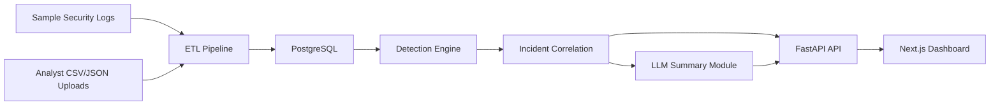

Plain-English flow:

1. Fake security logs can be loaded from `data/`, or analysts can upload CSV/JSON logs from the dashboard.
2. The ETL pipeline stores original records and normalized events in PostgreSQL.
3. Detection rules analyze normalized events and create alerts.
4. Incident correlation groups related alerts into investigation-ready incidents.
5. FastAPI exposes events, alerts, incidents, workflow actions, and summaries.
6. The Next.js dashboard gives analysts a simple interface for reviewing the workflow.
7. The summary module generates auditable executive and technical summaries, using mock mode when no API key is configured.

More detail: [docs/architecture.md](docs/architecture.md)

## Features

- Realistic fake breach data across authentication, VPN, cloud audit, API access, and endpoint alert sources
- Analyst upload workflow for CSV, JSON arrays, and newline-delimited JSON logs
- Upload metadata tracking for datasets, files, source type, status, and record counts
- ETL normalization from mixed JSON and CSV logs into a common security event schema
- Raw event preservation for auditability
- Rule-based detection engine for suspicious breach activity
- Incident correlation engine that groups related alerts and evidence
- REST API for events, alerts, incidents, workflow execution, and summaries
- Optional LLM-style summary workflow with deterministic mock fallback
- Downloadable Markdown incident investigation reports
- Next.js dashboard for reviewing workflow results
- Dockerized full-stack local environment
- pytest coverage for backend models, ETL, detections, incidents, API endpoints, and summaries

## Demo Workflow

The sample data tells one connected breach investigation story:

1. `alex.morgan` has multiple failed login attempts.
2. The same user later has a successful login from an unusual documentation-range IP.
3. A VPN session is established for that user.
4. Cloud audit activity shows suspicious admin or privilege escalation behavior.
5. API access logs show abnormal data download behavior.
6. Endpoint telemetry reports suspicious malware or credential access activity.
7. Detection rules create alerts from the normalized event history.
8. Incident correlation groups those alerts into an investigation.
9. The summary workflow generates an auditable incident summary using the incident's evidence event IDs.

The dataset also includes normal user activity and service account activity for comparison. The upload workflow lets an analyst run a similar process on their own local CSV or JSON exports without changing the built-in demo data.

## Run Locally With Docker

Prerequisites:

- Docker Desktop is installed
- Docker Desktop is running

Run the full stack from PowerShell:

```powershell
cd C:\Projects\breach-analytics-genai
Copy-Item .env.example .env -Force
docker compose up --build -d
docker compose exec backend alembic upgrade head
Invoke-RestMethod -Method Post http://127.0.0.1:8000/workflow/run-all
```

Open the frontend dashboard:

```text
http://localhost:3000
```

Open the FastAPI docs:

```text
http://127.0.0.1:8000/docs
```

Stop the app:

```powershell
docker compose down
```

Optional full reset, including the local PostgreSQL volume:

```powershell
docker compose down -v
```

## Demo Script

Use this short walkthrough for a recruiter, hiring manager, or consulting-style technical review.

1. Start Docker from the project root:

```powershell
cd C:\Projects\breach-analytics-genai
Copy-Item .env.example .env -Force
docker compose up --build -d
```

2. Run migrations and the full backend workflow:

```powershell
docker compose exec backend alembic upgrade head
Invoke-RestMethod -Method Post http://127.0.0.1:8000/workflow/run-all
```

3. Open the dashboard at `http://localhost:3000`.
4. Review the dashboard counts to confirm events, alerts, and incidents were created.
5. Review the events section to show normalized telemetry from multiple log sources.
6. Review the alerts section to show detection rules firing on suspicious behavior.
7. Review the incidents section to show correlated alerts grouped into an investigation.
8. Open an incident detail view and generate the LLM incident summary.
9. Review the summary panel to show executive summary, technical summary, timeline, containment steps, and evidence event IDs.
10. Select **Export Report** to download the incident investigation as Markdown.
11. Open `http://127.0.0.1:8000/docs` to show the FastAPI endpoints and typed API contracts.

## Analyst Upload Workflow

The app supports two ingestion paths:

- Sample demo data from the repository's `data/` folder
- Analyst-uploaded CSV, JSON array, or newline-delimited JSON files from the dashboard or API

Uploaded files are stored in the local `uploads/` directory, which is ignored by Git. Metadata is stored in PostgreSQL through `UploadedDataset` and `UploadedFile` records. Uploaded records are preserved in `RawEvent`, normalized into `NormalizedEvent`, and can then be analyzed by the existing detection, incident correlation, and summary workflow.

Generic normalization maps common field names such as `timestamp`, `username`, `source_ip`, `destination_ip`, `asset`, `action`, `outcome`, `severity`, `mitre_technique_id`, and `message` into the existing event schema. Missing fields are allowed and become null or sensible defaults.

### Upload API Test Commands

PowerShell 7 example using an existing sample JSON file:

```powershell
$upload = Invoke-RestMethod `
  -Method Post `
  -Uri http://127.0.0.1:8000/uploads `
  -Form @{
    name = "Uploaded auth logs"
    source_type = "auth"
    description = "Testing upload ingestion with sample auth logs"
    file = Get-Item .\data\auth_logs.json
  }

$datasetId = $upload.id
Invoke-RestMethod http://127.0.0.1:8000/uploads
Invoke-RestMethod http://127.0.0.1:8000/uploads/$datasetId
Invoke-RestMethod -Method Post http://127.0.0.1:8000/uploads/$datasetId/normalize
Invoke-RestMethod -Method Post http://127.0.0.1:8000/uploads/$datasetId/run-workflow
```

If your PowerShell version does not support `-Form`, use `curl.exe` from PowerShell:

```powershell
curl.exe -X POST http://127.0.0.1:8000/uploads `
  -F "name=Uploaded auth logs" `
  -F "source_type=auth" `
  -F "description=Testing upload ingestion" `
  -F "file=@data/auth_logs.json"
```

## API Endpoints

Key endpoints:

- `GET /health`
- `GET /events`
- `GET /alerts`
- `GET /incidents`
- `POST /workflow/run-all`
- `POST /uploads`
- `GET /uploads`
- `GET /uploads/{dataset_id}`
- `POST /uploads/{dataset_id}/normalize`
- `POST /uploads/{dataset_id}/run-workflow`
- `POST /incidents/{incident_id}/summarize`
- `GET /incidents/{incident_id}/summary`
- `GET /incidents/{incident_id}/report`

Interactive API documentation is available at:

```text
http://127.0.0.1:8000/docs
```

Example PowerShell commands:

```powershell
Invoke-RestMethod http://127.0.0.1:8000/health
Invoke-RestMethod "http://127.0.0.1:8000/events?limit=5"
Invoke-RestMethod "http://127.0.0.1:8000/alerts?severity=high"
Invoke-RestMethod "http://127.0.0.1:8000/incidents?status=open"
Invoke-RestMethod -Method Post http://127.0.0.1:8000/incidents/1/summarize
Invoke-RestMethod http://127.0.0.1:8000/incidents/1/summary
```

## Incident Report Export

The incident detail page includes an **Export Report** button. It downloads a Markdown investigation report containing:

- Incident overview, severity, status, affected user, and affected assets
- Latest executive and technical summaries when available
- Attack timeline and triggered alerts
- Evidence event IDs
- Recommended containment steps
- Analyst notes placeholder
- Report limitations

The report still exports when no LLM summary exists; it uses incident and evidence data with clear fallback text.

Download a report through PowerShell:

```powershell
Invoke-WebRequest `
  -Uri http://127.0.0.1:8000/incidents/1/report `
  -OutFile .\incident-1-report.md
```

## Screenshots

The images below render inline on GitHub and show the full breach analytics workflow from dashboard overview through API documentation.

### Dashboard Overview

Portfolio dashboard with workflow context and populated counts for normalized events, alerts, incidents, and summaries.

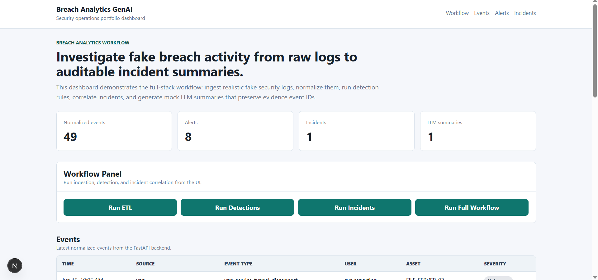

### Normalized Events

Normalized telemetry from authentication, VPN, cloud audit, API access, and endpoint sources.

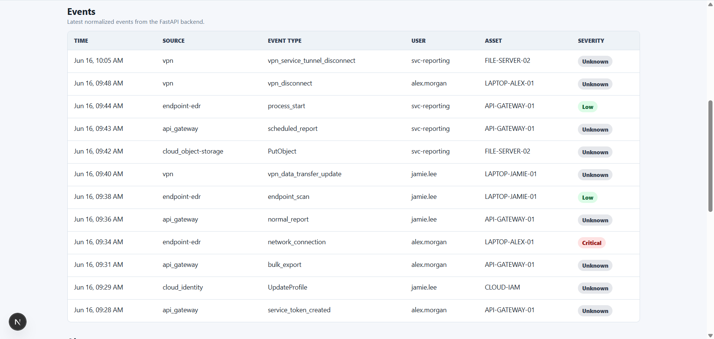

### Detection Alerts

Detection results showing rule names, severity, related users, affected assets, and alert descriptions.

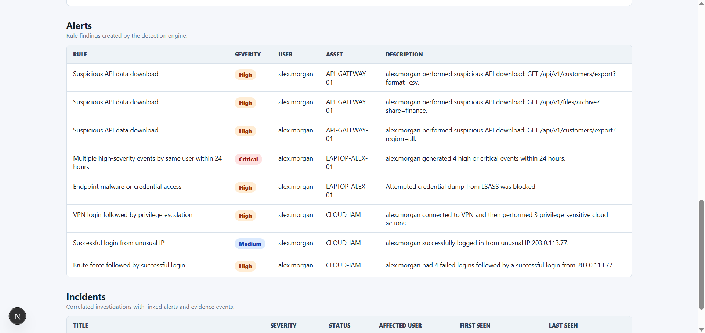

### Correlated Incidents

Correlated investigations with incident severity, status, affected user, and first/last seen timestamps.

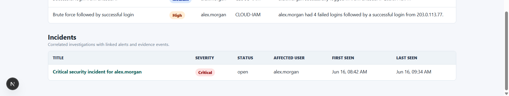

### Incident Detail

Incident detail view tying together related alerts, related events, investigation context, and summary controls.

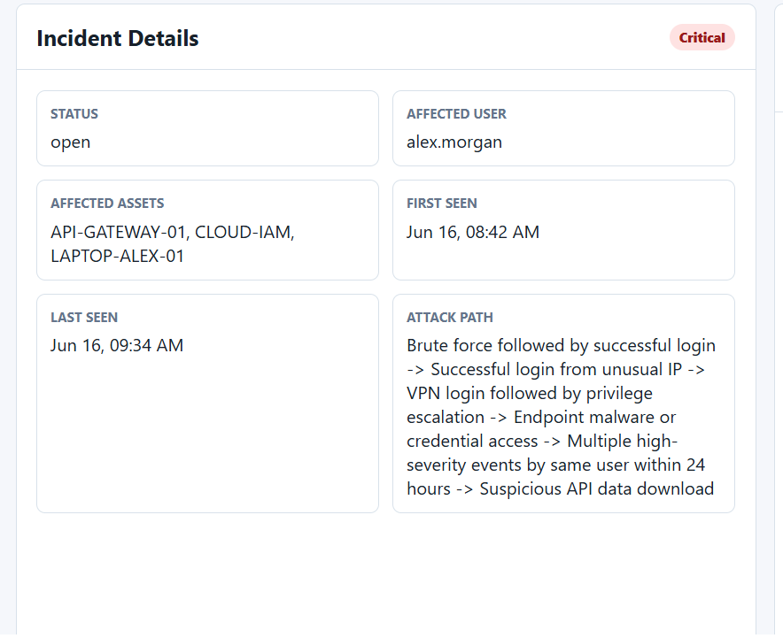

### LLM Incident Summary

Executive summary generated from stored incident, alert, and event evidence.

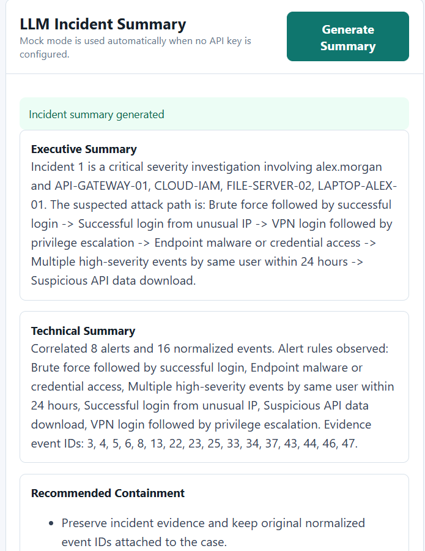

Technical summary and attack timeline designed for analyst review.

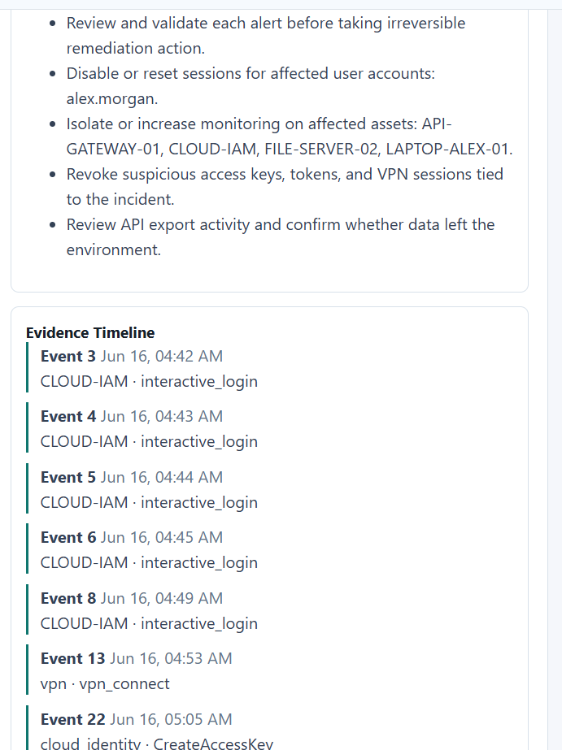

Containment recommendations and evidence event IDs for auditability.

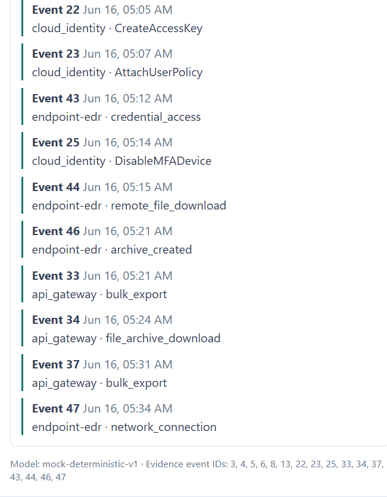

### FastAPI API Docs

Swagger UI showing the documented backend endpoints.

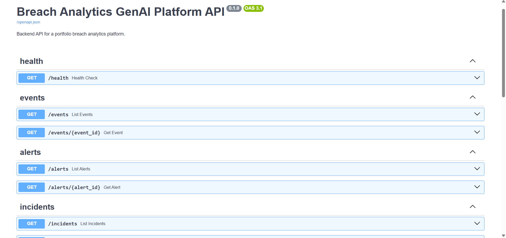

Workflow and incident endpoints used to run the backend pipeline and generate summaries.

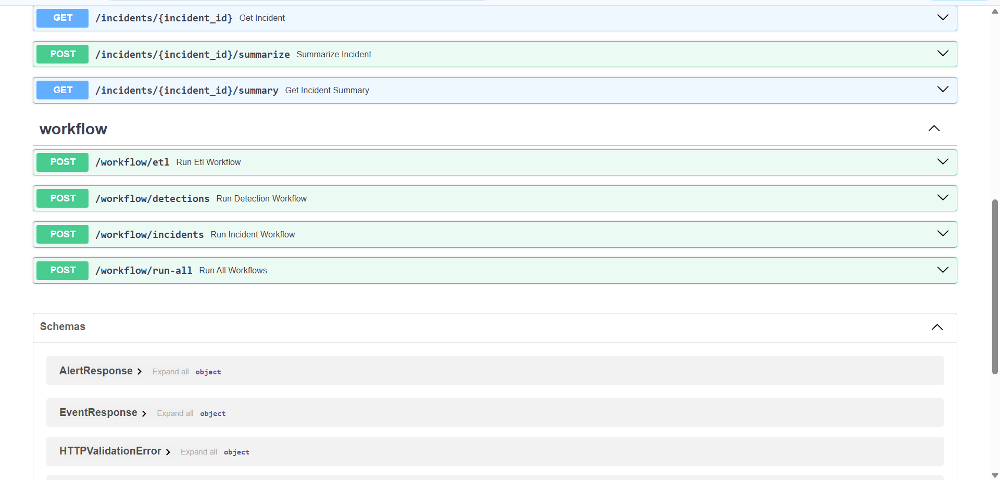

Schema documentation for API responses and typed backend contracts.

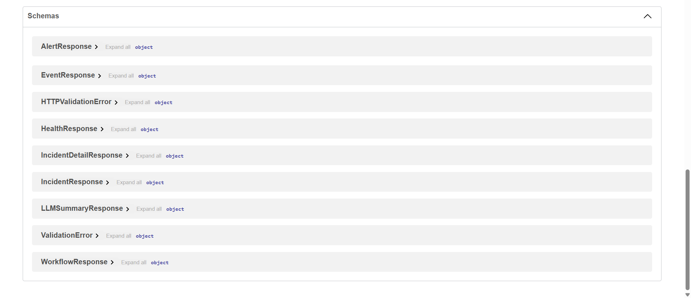

Screenshot files and capture notes: [docs/screenshots/README.md](./docs/screenshots/README.md)

## Testing

Run backend tests inside Docker:

```powershell
docker compose exec backend python -m pytest
```

Useful verification commands:

```powershell
docker compose ps
Invoke-RestMethod http://127.0.0.1:8000/health
docker compose exec backend alembic current
```

## Resume Bullet Examples

- Built a full-stack breach analytics platform using FastAPI, PostgreSQL, SQLAlchemy, Alembic, Next.js, React, TypeScript, and Docker Compose.
- Developed an ETL pipeline that ingests mixed JSON/CSV security telemetry, preserves raw records, and normalizes events into a queryable breach investigation schema.
- Implemented rule-based detections for brute force activity, unusual login behavior, privilege escalation, suspicious API downloads, endpoint alerts, and high-severity event clustering.
- Created incident correlation logic that groups related alerts, links supporting evidence events, assigns incident severity, and produces readable suspected attack paths.
- Designed an auditable LLM-ready summary workflow with deterministic mock mode, evidence event IDs, executive summaries, technical summaries, timelines, and containment recommendations.

## Limitations

- The included telemetry is realistic but synthetic; no real personal data, customer data, or production logs are used.
- Uploaded files are stored locally for development review and should not be treated as production evidence storage.
- The generic upload normalizer handles common field names but cannot fully understand every vendor-specific schema yet.
- Detection rules are deterministic examples intended for portfolio demonstration, not a replacement for a production SIEM or managed detection platform.
- The LLM workflow defaults to deterministic mock mode so the project runs reliably without paid API access or external network dependencies.
- Incident reports currently export as Markdown only; PDF rendering remains a future improvement.
- Authentication, authorization, audit logging, and production-grade secrets management are not implemented yet.
- The Docker Compose setup is optimized for local review and development, not hardened cloud deployment.

## Future Improvements

- Authentication and role-based access control
- Cloud deployment
- Real SIEM integrations
- Source-specific upload templates and validation
- Richer visualizations and timeline views
- Analyst notes and investigation comments
- Exportable PDF incident reports

## Project Structure

```text
breach-analytics-genai/
  backend/              FastAPI app, SQLAlchemy models, Alembic migrations, tests
  data/                 Fake security telemetry used by the ETL pipeline
  docs/                 Architecture notes and screenshot guidance
  frontend/             Next.js / React / TypeScript dashboard
  uploads/              Local analyst uploads ignored by Git
  docker-compose.yml    PostgreSQL, backend, and frontend services
  .env.example          Local Docker environment template
```
