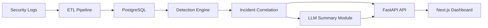

# Architecture

The Breach Analytics GenAI Platform is organized around a practical breach investigation workflow: collect telemetry, normalize it, detect suspicious behavior, correlate evidence, expose the results through APIs, and summarize the incident for analysts.

The design emphasizes auditability, repeatable local execution, and clear separation between data ingestion, analytics logic, API delivery, and user interface layers.

## System Diagram

## Component Responsibilities

### Security Logs

The `data/` folder contains realistic synthetic telemetry from authentication, VPN, cloud audit, API access, and endpoint alert sources. The records intentionally use slightly different field names so the ETL layer has to normalize them.

### ETL Pipeline

The ETL pipeline extracts JSON and CSV records, preserves each original payload in `RawEvent`, transforms each source into a common schema, and stores the result in `NormalizedEvent`.

The normalized schema supports investigation fields such as timestamp, source system, event type, username, source IP, destination IP, asset, action, outcome, severity, MITRE technique ID, and message.

### PostgreSQL

PostgreSQL stores raw events, normalized events, alerts, incidents, incident-event evidence links, and LLM summaries. SQLAlchemy models define the schema, and Alembic manages migrations.

### Detection Engine

The detection engine queries normalized events and creates alerts for suspicious patterns, including brute force followed by success, unusual successful login, VPN activity followed by privilege escalation, suspicious API downloads, endpoint malware or credential access alerts, and multiple high-severity events by the same user.

### Incident Correlation

The correlation layer groups related alerts into incidents using related username, asset, time window, severity, and evidence event IDs. It updates alert incident links and stores event evidence through the incident-event association table.

### FastAPI API

FastAPI exposes health checks, event listings, alert listings, incident details, workflow execution, and incident summary endpoints. This makes the backend usable from the dashboard, Swagger UI, or PowerShell commands.

### Next.js Dashboard

The dashboard presents the breach analytics workflow in a reviewer-friendly UI: overview counts, workflow buttons, normalized events, alerts, incidents, incident details, and stored summaries.

### LLM Summary Module

The summary module generates executive summaries, technical summaries, timelines, affected users, affected assets, suspected attack paths, containment recommendations, and evidence event IDs. If no `OPENAI_API_KEY` is configured, deterministic mock mode keeps the project runnable and auditable.

## Design Notes

- The project uses synthetic data only, so it is safe to publish and demo.
- Raw payloads are preserved to support auditability and traceability.
- Workflow steps can be run from CLI modules, API endpoints, or the dashboard.
- The summarization flow is intentionally evidence-bound and stores event IDs used in each summary.
- Docker Compose keeps the database, backend, and frontend reproducible for local review.

## Local Runtime

Docker Compose starts three services:

- `db`: PostgreSQL
- `backend`: FastAPI and backend workflow commands
- `frontend`: Next.js dashboard

The browser accesses the backend at `http://localhost:8000`. Next.js server-side rendering inside Docker uses `http://backend:8000` through `FRONTEND_SERVER_API_BASE_URL`.
